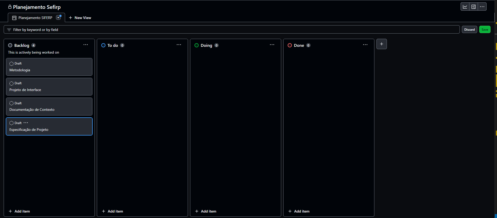
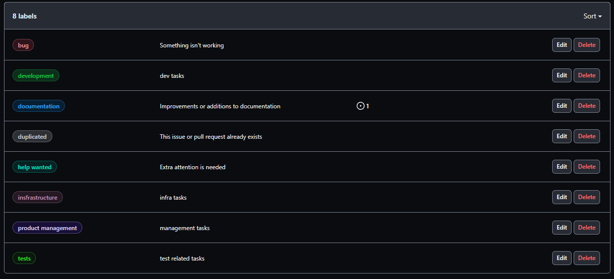

# Metodologia

Esta seção descreve a organização da equipe para a execução das tarefas do projeto e as ferramentas utilizadas para a manutenção dos códigos e demais artefatos.

## Gerenciamento de Projeto
A metodologia ágil adotada para este projeto é o SCRUM, uma abordagem de desenvolvimento de software criada por Jeff Sutherland na década de 1990. O SCRUM se baseia em conceitos tradicionais da engenharia de produção, valorizando times pequenos, multidisciplinares e autogerenciáveis no desenvolvimento de produtos (BESSA, 2018). Além das características mencionadas anteriormente, outros fatores que influenciaram na escolha dessa metodologia para o desenvolvimento do projeto foram: sua flexibilidade, estímulo à colaboração eficaz entre equipes e partes interessadas, habilidade ágil de se adaptar a mudanças e fornecer incrementos de valor contínuos ao cliente. O SCRUM promove transparência, inspeção e adaptação constantes, assegurando a entrega de um produto final alinhado às necessidades do usuário.

### Divisão de Papéis

A equipe utiliza o Scrum como base para definição do processo de desenvolvimento.
[Adicione informações abaixo sobre a divisão de papéis entre os membros da equipe.]
- Scrum Master: Rafael Maltez de Aguiar Costa
- Product Owner: Simon Cauã Siqueira de Moura
- Equipe de Desenvolvimento: Elismar Ramos, Felipe Gomes Meca, Pedro Henrique Gomes, Rafael Maltez de Aguiar Costa, Simon Cauã de Siqueira Moura
- Equipe de Design: Elismar Ramos, Felipe Gomes Meca

### Processo

O grupo optou por utilizar o Github Projects para gerenciamento de suas atividades, utilizando um quadro Kanban com as seguintes colunas:

- Backlog: recebe as tarefas a serem trabalhadas e representa o Product Backlog. Todas as atividades identificadas no decorrer do projeto também devem ser incorporadas a esta lista.
- To Do: Esta lista representa o Sprint Backlog. Este é o Sprint atual que estamos trabalhando.
- Doing: Quando uma tarefa tiver sido iniciada, ela é movida para cá.
- Done: nesta lista são colocadas as tarefas que passaram pelos testes e controle de qualidade e estão prontos para ser entregues ao usuário. Não há mais edições ou revisões necessárias, ele está agendado e pronto para a ação.

### Etiquetas

As tarefas são, ainda, etiquetadas em função da natureza da atividade e seguem o seguinte esquema de cores/categorias:

<ul>
  <li>Bug (Erro no código)</li>
  <li>Desenvolvimento (Development)</li>
  <li>Documentação (Documentation)</li>
  <li>Gerência de Projetos (Project Management)</li>
  <li>Infraestrutura (Infrastructure)</li>
  <li>Testes (Tests)</li>
  <li>Duplicada (Duplicated) </li>
  <li>Necessita ajuda (Help Wanted)</li>
</ul>

<figure>
  Figura 3 - Tela do esquema de cores e categorias</figcaption>
</figure>

### Ferramentas

Os artefatos do projeto são desenvolvidos a partir de diversas plataformas e a relação dos ambientes com seu respectivo propósito é apresentada na tabela que se segue.

| AMBIENTE                            | PLATAFORMA                         | LINK DE ACESSO                         |
|-------------------------------------|------------------------------------|----------------------------------------|
| Repositório de código fonte         | GitHub                             | [Repositório](https://github.com/ICEI-PUC-Minas-PMV-ADS/pmv-ads-2023-2-e1-proj-web-t2-sitecontroledefinancas)                     |
| Documentos do projeto               | GitHub                             | [Documentos](https://github.com/ICEI-PUC-Minas-PMV-ADS/pmv-ads-2023-2-e1-proj-web-t2-sitecontroledefinancas/tree/main/documentos) |
| Projeto de Interface                | CorewDraw/MarvelApp                | [Fluxo Interativo no Marvel App](https://marvelapp.com/prototype/305739f6/screen/92814751)                                       |
| Gerenciamento do Projeto            | GitHub Projects                    | [Quadro Kanban](https://github.com/orgs/ICEI-PUC-Minas-PMV-ADS/projects/668)                                                      |
| Hospedagem                          | Netlify                            | [Netlify](https://www.netlify.com/)                                                                                               |

### Estratégia de Organização de Codificação

Todos os artefatos relacionados a implementação e visualização dos conteúdos do projeto do site deverão ser inseridos na pasta [codigo-fonte](https://github.com/ICEI-PUC-Minas-PMV-ADS/pmv-ads-2023-2-e1-proj-web-t2-sitecontroledefinancas/tree/main/codigo-fonte). Consulte também a nossa sugestão referente a estratégia de organização de codificação a ser adotada pela equipe de desenvolvimento do projeto.
