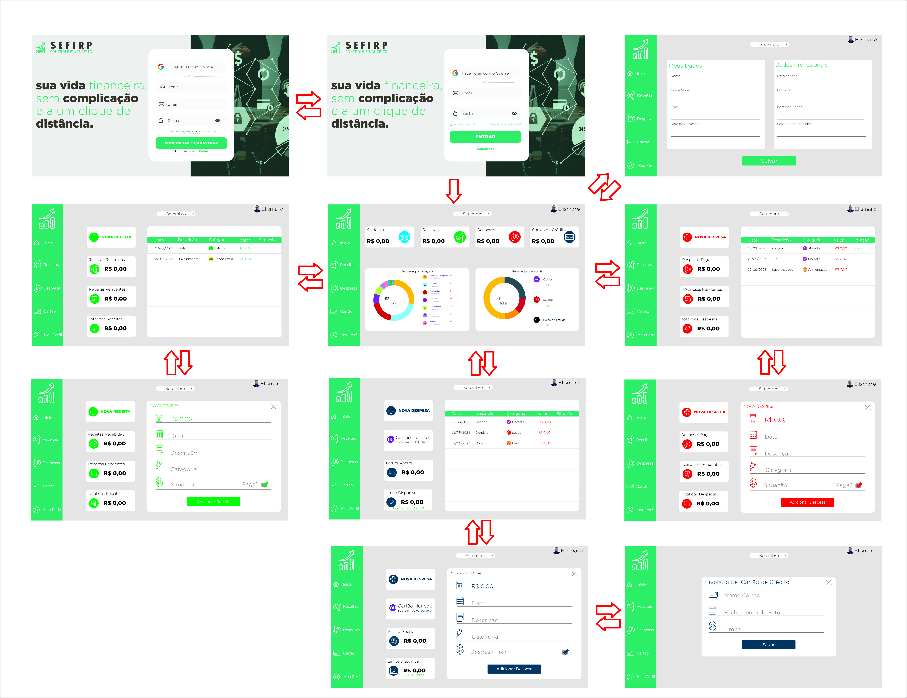
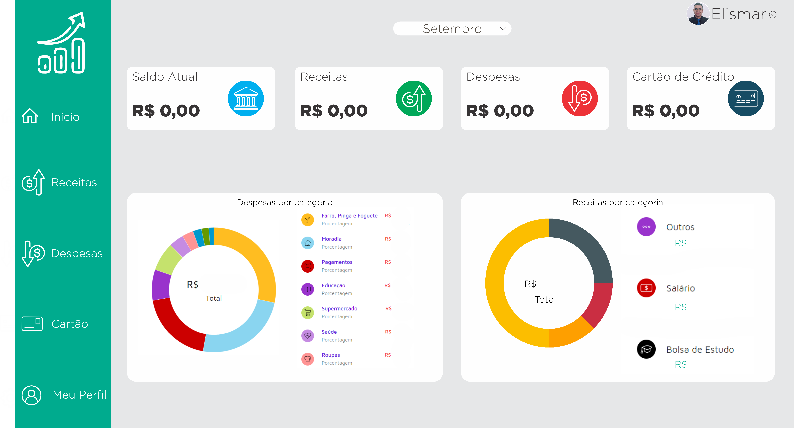
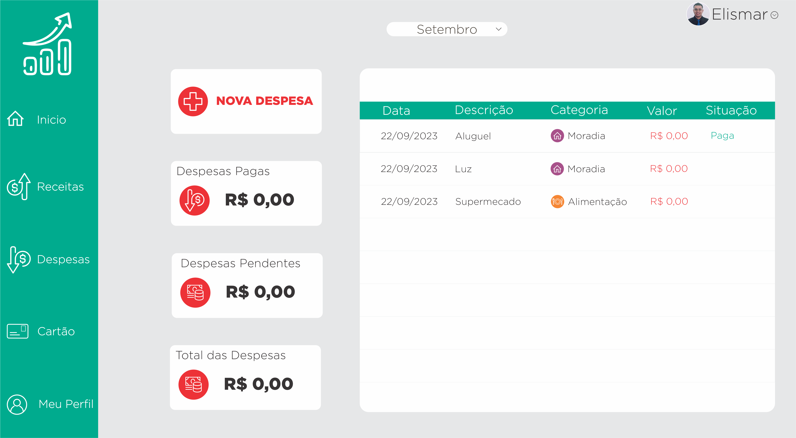
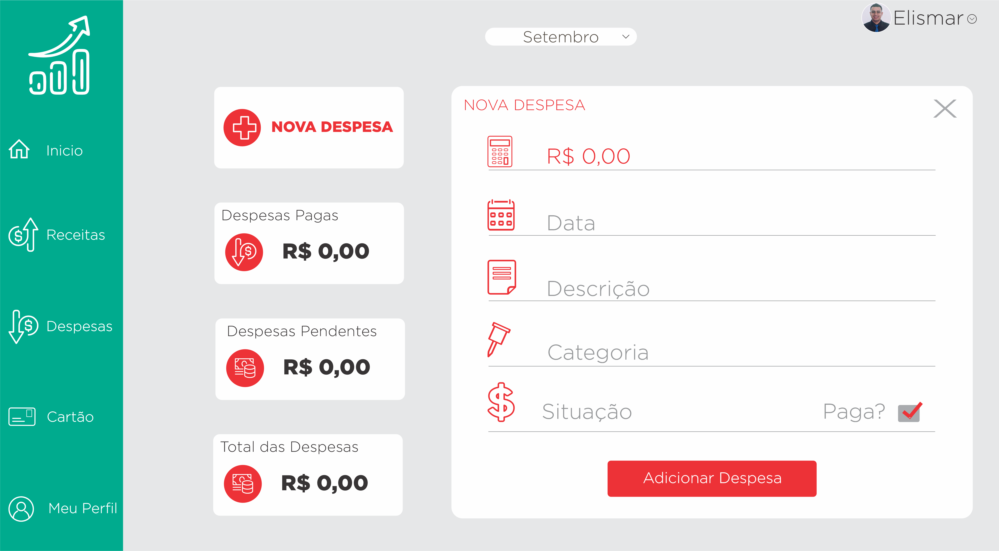
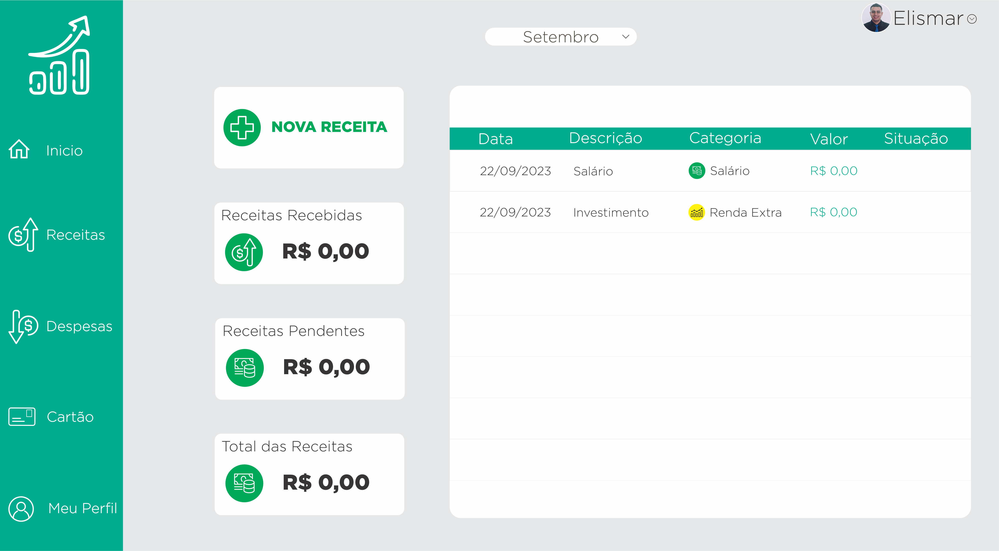
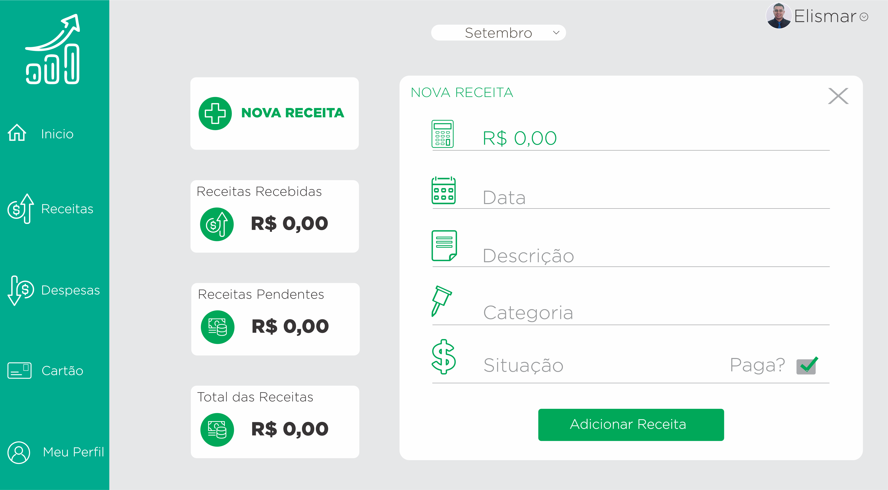
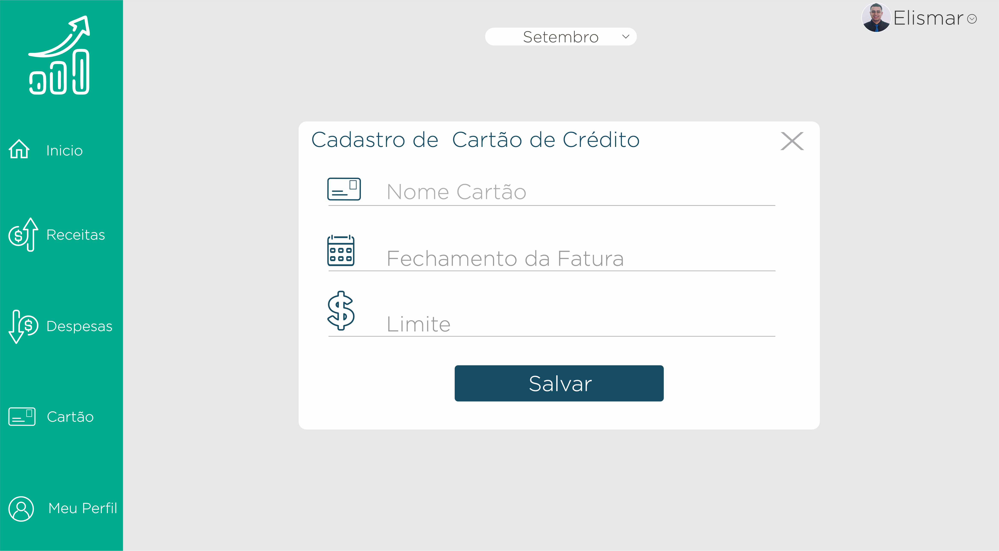
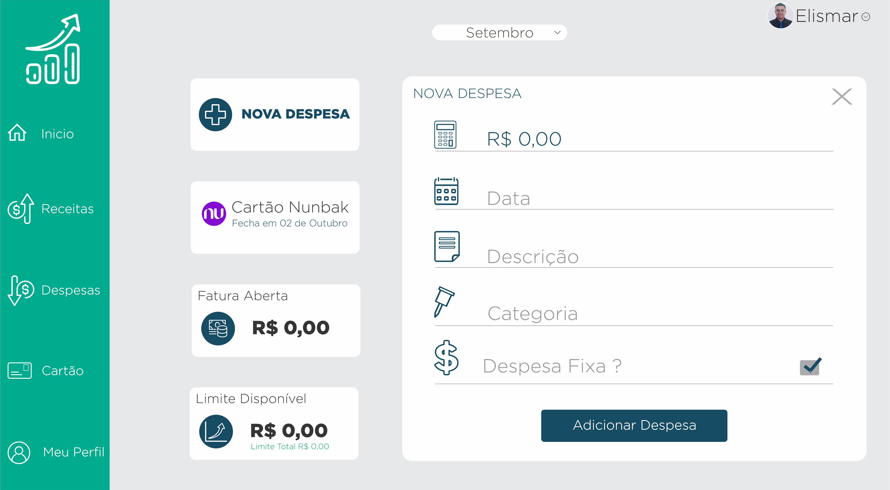
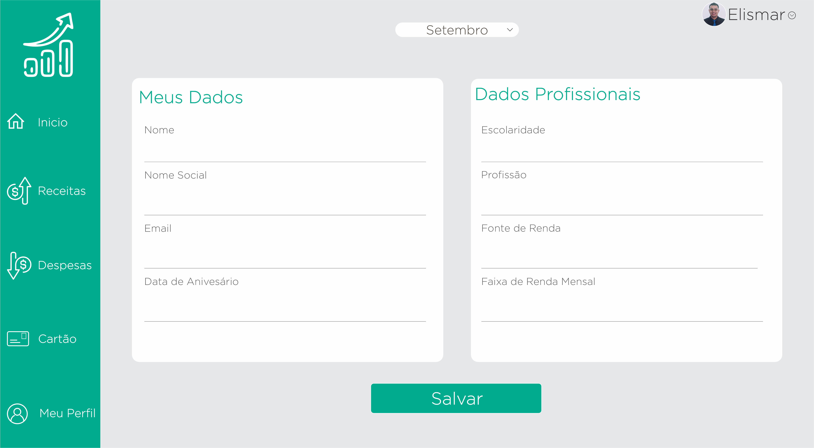

# Projeto de Interface

## User Flow

O fluxograma representa a ordem das interações do usuário pelo site, mostrando sua trajetória desde o começo até alcançar um objetivo específico. Cada passo desse fluxo é explicado em detalhes na seção de Protótipo de Baixa Fidelidade, oferecendo uma visão visual das telas que o usuário encontrará nessa jornada. Essa abordagem ajuda a entender completamente a experiência do usuário e facilita ajustes para uma melhor usabilidade da interface.

## Protótipo

### Protótipo de baixa fidelidade

A página inicial do site apresenta um design simples e intuitivo, com foco em proporcionar uma visão geral das finanças do usuário. 
No menu à esquerda, estão disponíveis a "Logomarca do Site" e  as opções de navegação como "Início", "Despesas", "Receitas", "Cartão" e "Meu Perfil". Essa característica garante fácil acesso às diferentes seções do site.
Na parte superior do site, são exibidos dados essenciais como “Saldo”, “Total de despesas”, “Total de Receitas” e Gasto com Cartão de Crédito”, permitindo uma rápida avaliação financeira. No cabeçalho a direita fica o "Nome de Usuário".
Na parte inferior da página inicial, dois gráficos apresentam a distribuição dos gastos por categoria e as receitas, fornecendo uma representação visual clara dos padrões financeiros. Em resumo, a página inicial é informativa e acessível, permitindo uma visão rápida da situação financeira e uma navegação eficiente pelo site. 

 

A seguir, apresentaremos as telas do site por meio de protótipos de média fidelidade. Este protótipo fornecerá uma visão mais detalhada e precisa da interface, atraves do link é possivel visualzar o protótipo  interativo feito no [Ambiente MarvalAPP](https://marvelapp.com/prototype/305739f6/screen/92814751)  permitindo uma melhor compreensão da usabilidade e da experiência do usuário.

### Tela - Login

A primeira página é a porta de entrada para os usuários. Nesta página, os usuários podem inserir suas credenciais de login, email, e senha para acessar sua conta. Além disso, há uma opção visível para os novos usuários se cadastrarem no site, permitindo que novas contas sejam criadas.

### Tela - Cadastro de Usuário 

Destinada à criação de novas contas de usuário. Aqui, os usuários podem preencher os campos com suas informações pessoais, como nome, e-mail e senha. Ao clicar no botão "Cadastrar", os dados são registrados e a conta é criada, permitindo que o usuário acesse o site.

### Tela - Inicial

A Página inicial do site, oferece uma visão geral das finanças do usuário. No menu à esquerda, estão disponíveis a "Logomarca do Site" e  as opções de navegação, como "Início", "Despesas", "Receitas", "Cartão de Crédito" e "Meu Perfil". Na parte superior, é exibido o "Mês de referêcia", o  "Saldo atual", o "Total de Despesas", o "Total de Receitas" e as "Despesas com Cartão de Crédito".No cabeçalho a direita fica o "Nome de Usuário". Na parte inferior, são apresentados gráficos que mostram a distribuição dos gastos e receitas por categoria.

### Tela - Despesas

Esta página exibe informações sobre as despesas do usuário. Com ícone que permite adicionar "Nova despesas" , e campo para visualizar "Despesas Pagas", "Despesas pendentes" e o "Total das despesas". Além disso, é apresentada uma lista de despesas já registradas no site no lado direito da página.

### Tela - Adicionar Nova Despesa

Esta página aparece após clicar no ícone “Nova Despesa” descrito na página anterior, nele os usuários podem inserir detalhes de uma nova despesa, como descrição, valor, categoria e data e situação da despesa. Ao preencher os campos e clicar em "Adicionar Despesa", a nova despesa é registrada e incorporada ao site.

### Tela - Receitas

Esta página oferece informações sobre as receitas do usuário. Os ícones e opções permitem adicionar "Nova Receita", visualizar "Receitas Recebidas", "REceitas Pendentes" e o  "Total das Receitas". Uma lista de receitas já registradas no site é exibida no lado direito da página.

### Tela - Adicionar Nova Receita

Os usuários podem acessar esta página para registrar suas receitas. Ao clicar em "Nova Receita" descrito na página anterior, são levados a um formulário onde podem inserir detalhes como descrição, valor, categoria, data e situação da receita. Após preencher as informações, clicam em "Adicionar Receita" para incluí-la em seu perfil.

### Tela - Cartão de Crédito 

Na página relacionada ao cartão de crédito, os usuários podem adicionar novas despesas associadas ao cartão através do ícone “Nova Despesa”, visualizar informações do cartão como o limite total, o valor da fatura aberta e o limite disponível, qual cartão está cadastrado e data do fechamento da fatura.

### Tela - Adicionar Novo Cartão de Crédito

Nesta página, os usuários têm a opção de adicionar um novo cartão de crédito ao seu perfil. Eles podem inserir o nome do cartão, o limite e data do fechamento da fatura

 

### Tela - Adicoinar Despesa do Cartão de Crédito 

Nesta página, os usuários podem cadastrar despesas relacionadas ao seu cartão de crédito. Ao selecionar "Nova Despesa" no menu, os usuários são direcionados a um formulário onde inserem dados como descrição, valor, categoria, data e situação da despesa. Clicando em "Adicionar Despesa", a transação é registrada no sistema.

### Tela - Cadastro de Dados Pessoais
 
 Esta página permite aos usuários atualizarem suas informações pessoais. Ao escolher "Meu Perfil" no menu à esquerda, os usuário são direcionados a um formulário onde podem editar nome, nome social, data de aniversário, email, fonte de renda, escolaridade, profissão, faixa de renda mensal. Ao finalizar as edições, clicam em "Salvar" para garantir que suas informações estejam precisas e atualizadas no site.

 
