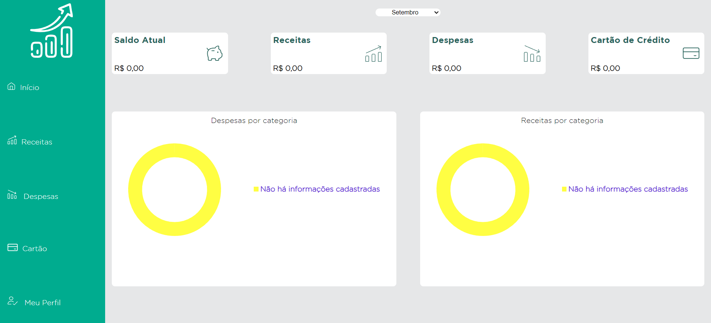
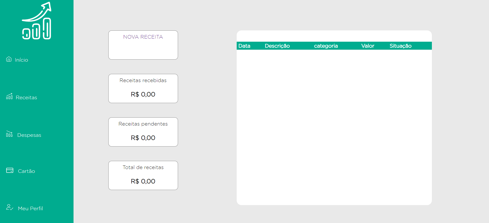

# Template padrão da Aplicação

O layout padrão da aplicação foi desenvolvido utilizando linguagem de marcação HTML, folhas de estilo CSS e linguagem de programação Javascript para renderização dos gráficos, através da biblioteca [Donut JS](https://github.com/finom/donutjs).

O template padrão consiste em um menu de navegação lateral, cards, tabelas e gráficos dispostos no restante da página.
O codigo fonte da aplicação está disponivel [nesse link](/codigo-fonte/src).
Os icones utilizados na aplicação estão disponiveis [aqui](/codigo-fonte/src/icons/).

<ul>
<li>Cores: #00AB8E, #514A42, #C6C6C6, #D0D3D3. #EFEFEF, #FFFFFF;</li>
<li>Font-family: Gotham, variações Light e Bold.</li>
<li>Recursos de estilo: Flexbox e Grid. </li>
</ul>

Abaixo, exemplos de páginas que seguem o template padrão:

<h3><b>Página Inicial</b></h3>

Apresenta uma visão geral das finanças do usuário logado no sistema.

<figure>
  
  <figcaption> Figura 1 - Página Inicial
</figure>

<h3><b>Página de Receitas</b></h3>

Apresenta uma visão das receitas do usuário logado no sistema.

<figure>
  
  <figcaption> Figura 2 - Página de Receitas
</figure>

