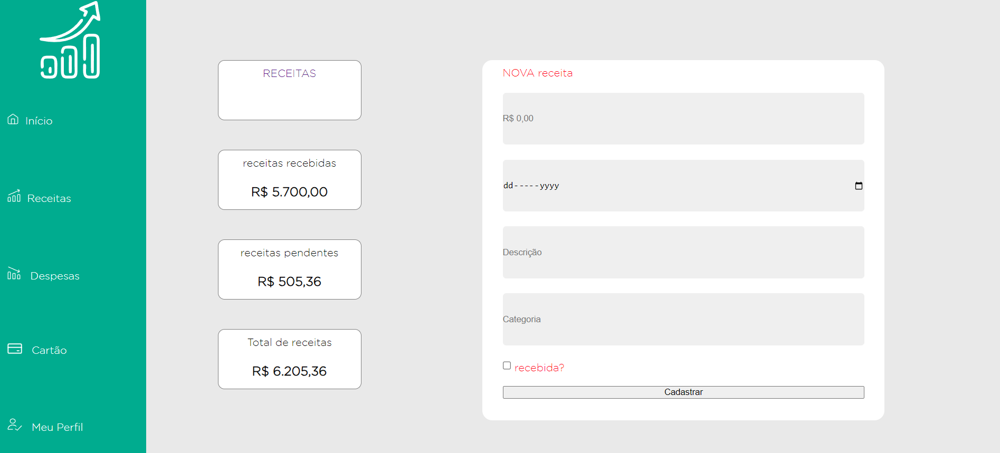
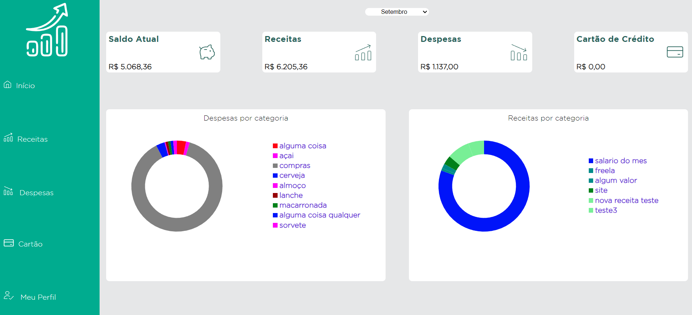

# Programação de Funcionalidades

Implementação da aplicação descritas por meio dos requisitos codificados.


### Cadastro de usuários


#### Requisito atendido

RF-01: O site deve permitir que o usuário faça o cadastro de sua conta na plataforma


#### Artefatos da funcionalidade

<ul>
  <li>cadastro/index.html</li>
  <li>cadastro.css</li>
  <li>cadastro.js</li>
</ul>


#### Estrutura de Dados

Objetos e arrays para salvar as informações dos usuários cadastrados no localStorage.

Utilizamos um objeto cujas chaves são os e-mails dos usuários cadastrados para armazenar as informações referentes aos usuários.
Abaixo, exemplo do objeto `users` armazenado no localStorage:
```javascript
{
    email:  {                     // aqui é o e-mail do usuário, e não o literal 'email'
      data: {                     // para cada usuário, a chave data armazena informações pessoais
        name:                     // strig, nome do usuário
        password:                 // string, senha do usuário
      },
      expenses: [],               // array para armazenar objetos de cada despesa
      incomings: [],              // array para armazenar objetos de despesa
  }                               // (A estrutura de cada objeto está descrita na tela correspondente)
}

```


#### Instruções de acesso

Ao acessar a aplicação sem estar logado, a mesma irá redirecionar para a página de login. Pode-se clicar no botção com o texto CADASTRAR para ser redirecionado para a tela de cadastro.

Para realizar o cadastro, deve-se preencher o nome, e-mail e senha. O nome precisa ter no minimo 3 caracteres, o e-mail deve ser um e-mail válido, e a senha precisa ter no mínimo 6 caracteres.


#### Responsável

Rafael Maltez

--


### Login de usuários


#### Requisito atendido

RF-02: O site deve permitir que o usuário faça login, tendo acesso apenas às suas próprias finanças


#### Artefatos da funcionalidade

<ul>
  <li>login/index.html</li>
  <li>login.css</li>
  <li>login.js</li>
</ul>


#### Estrutura de Dados

Objetos e arrays para recuperar as informações dos usuários cadastrados no localStorage.
Além do objeto `users` utilizado no cadastro, temos um objeto chamado `loggedUser` , utilizado para armazenar as informações do usuário logado no sistema:
```javascript
{
    name:  // tipo string, armazena o nome
    email: // tipo string, armazena o e-mail do usuário
}

```
e o mesmo aobjeto após atualização de perfil (mais detalhes na tela correspondente):
```javascript
{
    name:         // string, armazena o nome do usuário
    nomeSocial:   // string, armazena o nome social do usuário
    email:        // string, armazena o e-mail do usuário
    password:     // string, armazena a senha do usuário
    escolaridade: // string, armazena a escolaridade do usuário
    profissao:    // string, armazena a profissão do usuário
    renda:        // armazena a fonte de renda do usuário
    faixaDeRenda: // string, armazena a fixa de renda do usuário
}

```


#### Instruções de acesso

Ao acessar a aplicação sem estar logado, a mesma irá redirecionar para a página de login. Deve-se utilizar um e-mail e senha previamente cadastrados para realizar o acesso.

#### Responsável

Elismar Ramos

--

### Cadastro de Receitas




#### Requisito atendido

RF-03: O site deve permitir o cadastro de novas receitas


#### Artefatos da funcionalidade

<ul>
  <li>receitas/index.html</li>
  <li>receitas/nova/index.html</li>
  <li>receitas.css</li>
  <li>novareceita.css</li>
  <li>receitas.js</li>
  <li>novareceita.js</li>
  <li>logged.js</li>
</ul>


#### Estrutura de Dados

Objetos e arrays para cadastrar e recuperar as informações das receitas cadastradas associadas ao usuário logado, a partir das informações armazenadas no localStorage.

Armazenamos as receitas em uma chave do tipo array chamada `incomings` no objeto referente a um respectivo usuário. Cada objeto de receita tem a seguinte estrutura:
```javascript
{
    id:           // inteiro, gerado com new Date().getTime(), identificador único da receita
    value:        // float, valor recebido,
    date:         // string, ano-mes-dia, data de entrada da receita
    description:  // string, descrição da receita,
    category:     // string,representa a categoria da receita. Opções: Salário, Investimentos,Freelancer,Bolsa,Mesada, Outra
    received:     // booleano, controla se a receita já foi recebida ou não.
  }               // a categoria Outra permite o cadastro de uma nova categoria por parte do usuário.

```

#### Instruções de acesso

Após fazer login na aplicação,clicar no menu lateral no item Receitas e em seguida no card escrito NOVA RECEITA. Preencher o formulário com as informações solicitadas e clicar no botão de confirmação.

#### Responsável

Felipe Gomes

--


### Cadastro de Despesas


#### Requisito atendido

RF-04: O site deve permitir o cadastro de novas despesas


#### Artefatos da funcionalidade

<ul>
  <li>despesas/index.html</li>
  <li>despesas/nova/index.html</li>
  <li>despesas.css</li>
  <li>novareceita.css</li>
  <li>despesas.js</li>
  <li>novareceita.js</li>
  <li>logged.js</li>
</ul>


#### Estrutura de Dados

Objetos e arrays para cadastrar e recuperar as informações das despesas cadastradas associadas ao usuário logado, a partir das informações armazenadas no localStorage.
Armazenamos as despeas em uma chave do tipo array chamada `expenses` no objeto referente a um respectivo usuário. Cada objeto de despesa tem a seguinte estrutura:
```javascript
{
    id:           // inteiro, gerado com new Date().getTime(), identificador único da despesa
    value:        // float, valor recebido,
    date:         // string, ano-mes-dia, data de entrada da despesa
    description:  // string, descrição da despesa,
    category:     // string,representa a categoria da despesa. Opções: Salário, Investimentos,Freelancer,Bolsa,Mesada, Outra
    payed:        // booleano, controla se a despesa já foi recebida ou não.
    card:         // booleano, controla se a despesa é referente a um cartão de crédito
}               // a categoria Outra permite o cadastro de uma nova despesa por parte do usuário.
```

#### Instruções de acesso

Após fazer login na aplicação,clicar no menu lateral no item Despesas e em seguida no card escrito NOVA DESPESA. Preencher o formulário com as informações solicitadas e clicar no botão de confirmação.

#### Responsável

Simon Cauã

--

### Página inicial do usuário logado




#### Requisito atendido

RF-05: O site deve permitir a visualização completa de receitas e despesas na página inicial do usuário logado


#### Artefatos da funcionalidade

<ul>
  <li>index.html</li>
  <li>home.css</li>
  <li>home.js</li>
  <li>logged.js</li>
  <li>donut.min.js</li>

</ul>


#### Estrutura de Dados

Objetos e arrays para recuperar as informações das despesas e receitas cadastradas associadas ao usuário logado, a partir das informações armazenadas no localStorage. Essas mesmas estruturas são utilizadas para a renderização dos gráficos de receitas e despesas, além dos cálculos de saldo e totais.

Nessa tela, são utilizados todos os objetos já mencionados anteriormente. Além deles, ulizamos dois objetos para contolar a paleta de cores padrão dos gráficos. São eles:
`incomingsCategories`, no seguinte formato:
```javascript
{
  Lazer:            // todos os valores são strings representando o valor
  Moradia:          // em hexadecimal da cor correspondente a ser utilizada
  Pagamentos:       // para gerar o gráfico e a legend
  Educação:
  Alimentação:
  Saúde:
  Transaporte:
  Vestuário:'
}

```

#### Instruções de acesso

Após fazer login na aplicação, o usuário é automaticamente redirecionado para a página correspondente a essa funcionalidade.

#### Responsável

Pedro Henrique