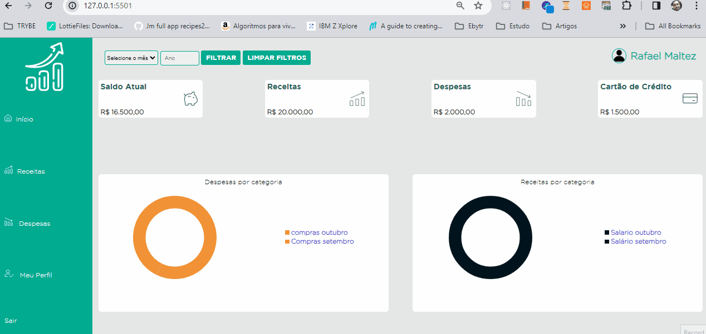
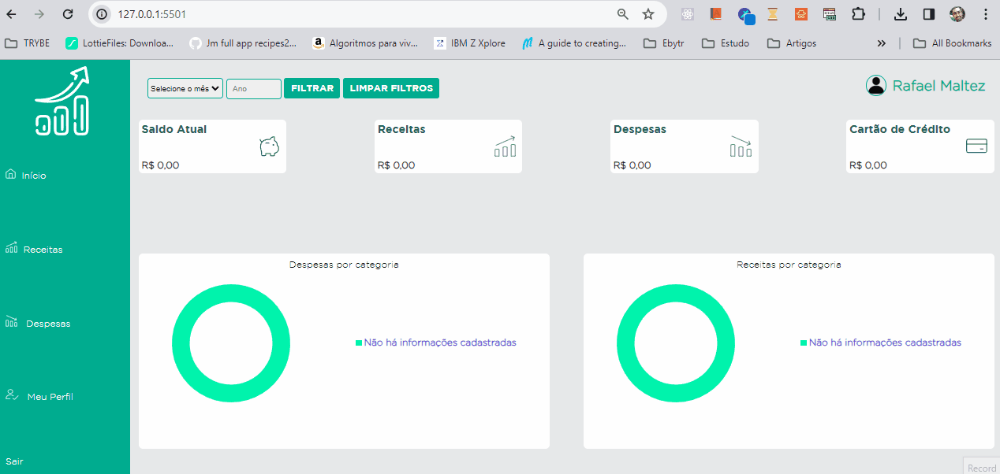

# Registro de Testes de Software

Relatório com as evidências dos testes de software realizados na aplicação pela equipe, baseado no plano de testes pré-definido.

Os resultados dos testes funcionais realizados na aplicação são descritos a seguir. [Utilize a estrutura abaixo para cada caso de teste executado]

|Caso de Teste    | CT-01 - Teste da página “Login" |
|:---|:---|
| Resultados obtidos | Todos as etapas do teste foram bem sucedidos conforme descritos no documento de Plano de Testes de Software, exceto pelos teste de responsividade, dado que ainda não foi implementada.  |
| Responsável pela execução do caso de Teste | Elismar |

 

|Caso de Teste    | CT-02 - Teste da página "Cadastro"  |
|:---|:---|
| Resultados obtidos | Todos as etapas do teste foram bem sucedidos conforme descritos no documento de Plano de Testes de Software, exceto pelos teste de responsividade, dado que ainda não foi implementada.  |
| Responsável pela execução do caso de Teste | Pedro |

 

|Caso de Teste    | CT-03 - Teste da página “Home" |
|:---|:---|
| Resultados obtidos | Todos as etapas do teste foram bem sucedidos conforme descritos no documento de Plano de Testes de Software, exceto pelos teste de responsividade, dado que ainda não foi implementada. |
| Responsável pela execução do caso de Teste | Simon |

 

|Caso de Teste    | CT-04 - Teste da página "Despesas" |
|:---|:---|
| Resultados obtidos |  |
| Responsável pela execução do caso de Teste | Elismar |

 

|Caso de Teste    | CT-05 - Teste da página "Receitas"" |
|:---|:---|
| Resultados obtidos | Todos as etapas do teste foram bem sucedidos conforme descritos no documento de Plano de Testes de Software, exceto pelos teste de responsividade, dado que ainda não foi implementada. | Rafael |

 

|Caso de Teste    | CT-06 - Teste da página "Meu Perfil"" |
|:---|:---|
| Resultados obtidos | Todos as etapas do teste foram bem sucedidos conforme descritos no documento de Plano de Testes de Software, exceto pelos teste de responsividade, dado que ainda não foi implementada. |
| Responsável pela execução do caso de Teste | Rafael |

 
